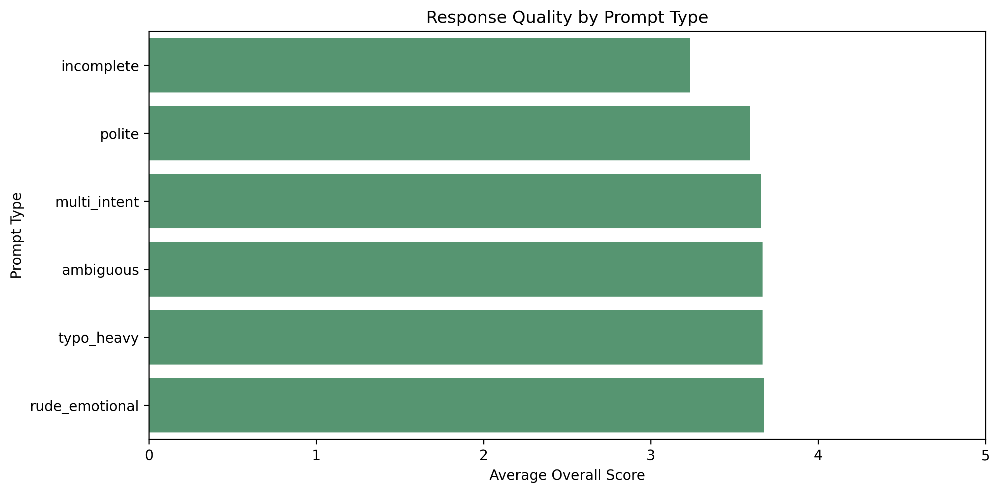
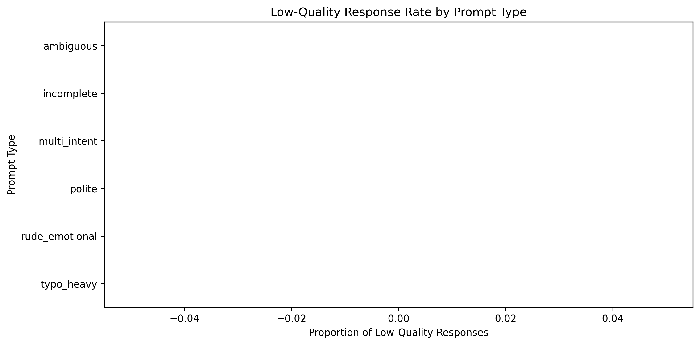
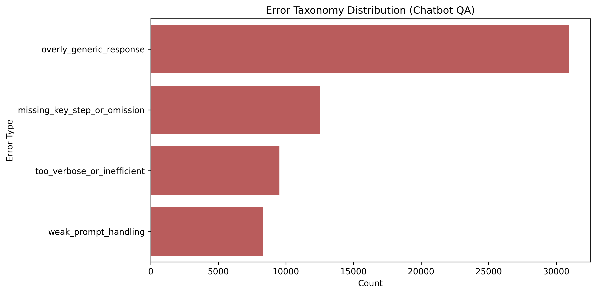
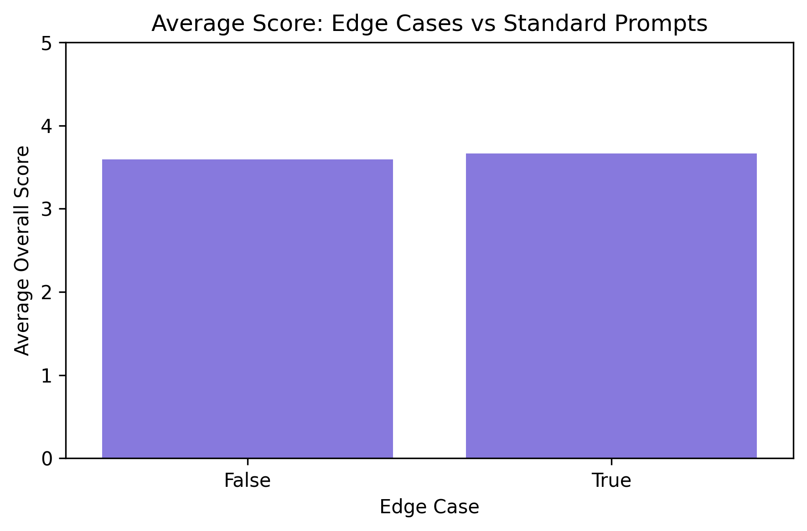
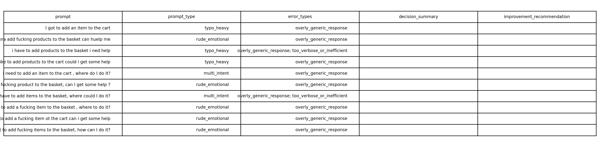

# AI-Evaluation-of-Chatbot-Robustness-to-Real-World-Customer-Language-E-commerce-QA-
This project evaluates how well AI chatbot responses handle messy, real-world customer language in an e-commerce setting. It applies a structured scoring framework, behavioural tagging, and error taxonomy analysis to identify performance patterns and improvement opportunities.

# 🧠 AI Evaluation of E-commerce Chatbot QA Responses for Prompt Robustness

## 📌 Overview
This project evaluates the robustness of AI-generated chatbot responses under noisy, informal, and real-world customer language.

It focuses on how well the chatbot handles:
- typo-heavy prompts  
- rude/emotional language  
- incomplete queries  
- ambiguous requests  
- multi-intent prompts  

---

## 🎯 Objectives
- Evaluate chatbot robustness to messy real-world language  
- Identify conversational patterns that reduce response quality  
- Measure whether intent is correctly reflected  
- Detect whether difficult prompts increase failure rates  

---

## 📊 Dataset
- **E-commerce Chatbot QA Dataset**
- Format: conversation-style message pairs  
- Extracted fields:
  - prompt  
  - ai_response  

---

## ⚙️ Methodology

### ✅ Evaluation Framework
Each response is scored across:
- Relevance  
- Intent Reflection  
- Robustness to Noise  
- Task Guidance  
- Clarity  
- Business Usefulness  

---

### ✅ Behavioural Prompt Tags
- polite  
- rude_emotional  
- incomplete  
- ambiguous  
- multi_intent  
- typo_heavy  

---

### ✅ Workflow
1. Parse message pairs into prompt/response  
2. Apply behavioural tagging  
3. Perform semi-automated scoring  
4. Generate insights + error taxonomy  
5. Visualise robustness patterns  

---

## 📈 Visual Analysis

### 📊 Response Quality by Prompt Type

**Insight:**  
Performance is stable across prompt types, indicating strong robustness to messy language.

---

### ⚠️ Low Quality Response Rate

**Insight:**  
Low-quality rates are near zero across all prompt types, showing consistent baseline performance.

---

### 🔍 Error Taxonomy

**Insight:**  
Generic responses dominate, indicating the main issue is not correctness but lack of specificity.

---

### ⚡ Edge Cases vs Normal Prompts

**Insight:**  
Edge cases perform similarly to standard prompts, confirming strong robustness.

---

### 📌 Edge Case Examples

**Insight:**  
Difficult prompts are handled safely but responses remain generic.

---

## 💡 Key Findings

- ✅ Strong robustness to noisy and messy prompts  
- ✅ No significant increase in failure rates for difficult prompts  
- ⚠️ Dominant issue: overly generic responses  
- ⚠️ Limited response specificity and contextual depth  

---

## 🧩 Key Insight

> The chatbot is reliable and safe, but not optimised.  
> The main limitation is **generic response generation**, not misunderstanding.

---

## 🏢 Business Implications

- ✅ Low risk of major failure  
- ⚠️ Risk to customer experience due to generic responses  
- ⚠️ Potential impact on conversion and support efficiency  

---

## 🚀 Recommendations

- Improve response specificity  
- Add clearer step-by-step guidance  
- Reduce generic templates  
- Enhance multi-intent handling  
- Maintain robustness strengths  

---

## ⚠️ Challenges

- Parsing messy conversational data  
- Overlapping prompt behaviour types  
- Auto-scoring limitations  

---

## 🔧 Future Improvements

- Add manual review layer  
- Introduce inter-rater checking  
- Refine error taxonomy  
- Compare clean vs noisy prompt performance  

---

## 🛠 Tools Used

- Python (pandas, numpy)  
- Matplotlib / Seaborn  
- Jupyter Notebook  

---

